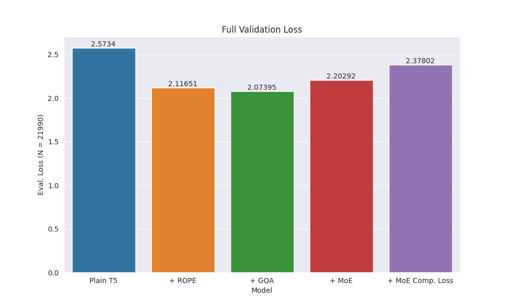
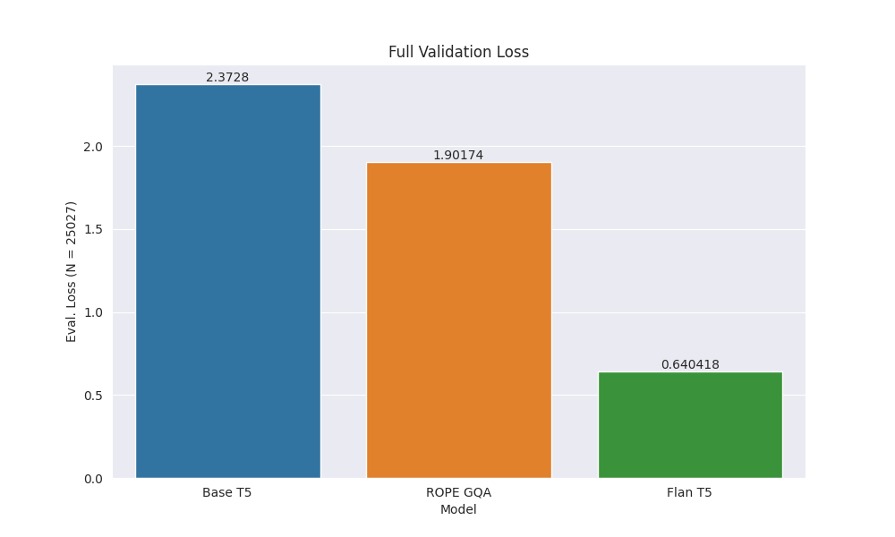
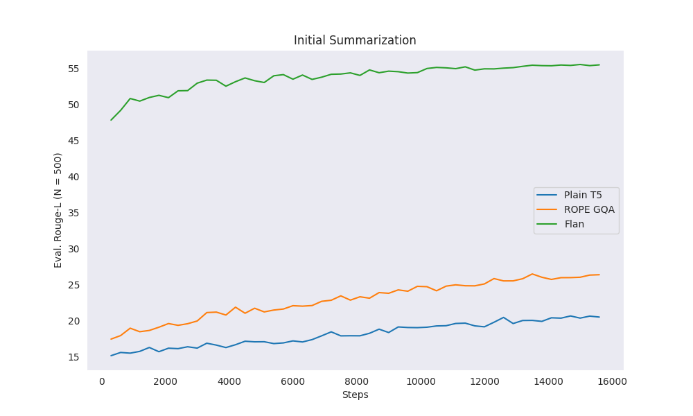
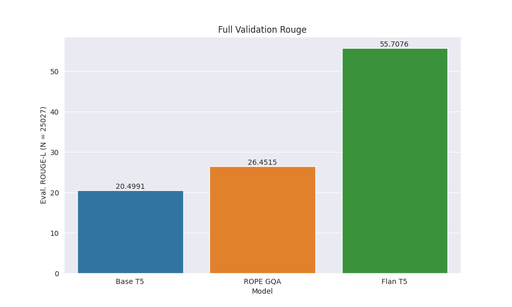
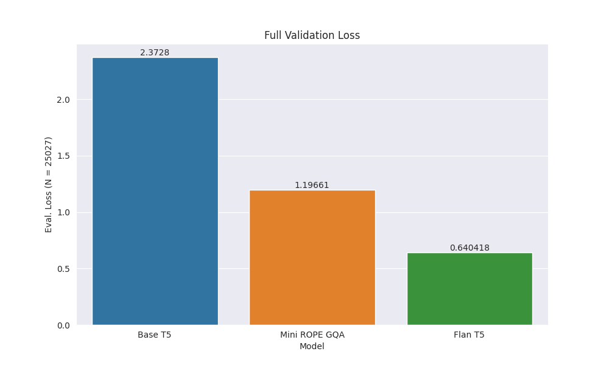
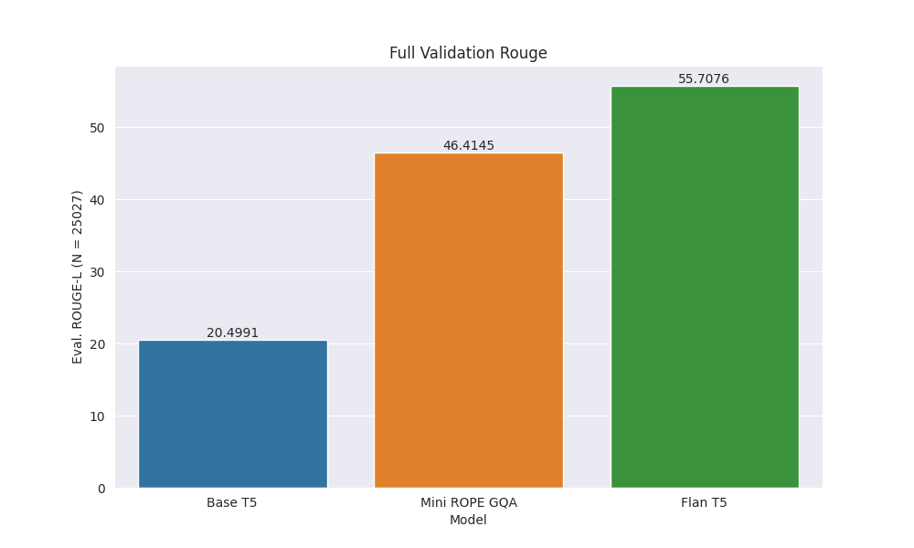

# ROT5

## Introduction

This project is an educational experiment on some advancements in the field of LLMs in the past years. Starting from the 
original transformer in 2017 with [Attention is All You Need](https://arxiv.org/abs/1706.03762), new developments have 
been made both in terms of pre-training methods and model architecture. To experiment with a subset of newer ideas, 
this project aims to take the T5 architecture, which is tried and tested, and incorporate new ideas found in literature 
after the introduction of T5. The augmentations include:
- [UL2 Pre-training Objective](https://arxiv.org/pdf/2205.05131.pdf)
- [ROPE Relative Embedding](https://arxiv.org/abs/2104.09864)
- [Grouped Query Attention](https://arxiv.org/pdf/2305.13245v3.pdf)
- [Sparse Mixture of Experts](https://arxiv.org/abs/2101.03961)
- [Chinchilla Scaling Law](https://arxiv.org/abs/2203.15556)

In addition, various papers on training LLMs were referenced for hyper-parameters and valuable experience on 
training LLMs:
- [Cramming BERT](https://arxiv.org/pdf/2212.14034.pdf)
- [RoBerta](https://arxiv.org/abs/1907.11692)
- [Original T5 Paper](https://arxiv.org/abs/1910.10683)
- [Minipile](https://arxiv.org/abs/2304.08442)
- [UL2R](https://arxiv.org/pdf/2210.11399.pdf)

Finally, to assess the different upgrades made to the T5 model, the goal of the project is to pre-train a model from 
scratch, and then fine-tune it on the summarization task to evaluate the model performances. In particular, the model 
would try to achieve an elementary level understanding of the English language by reading synthetic children's stories. 
Then, it would be trained to create summaries of children's stories. Thus, instead of just 
starting from the shoulders of models pre-trained on a large amount of tokens, the whole process is performed end-to-end 
in this experiment.

After making the adjustments, the architecture in the end would not be compatible with the model weights of the 
original T5 model. Thus, it ought to have a different name, the **R**eincarnated **O**pen **T5**.

## Initial Setup

### Tokenizer

The Mistral tokenizer with added special tokens, such as padding and mask tokens, is used for the experiment. The 
original T5 tokenizer is known for issues such as the inability to decode characters like 
"{". On the other hand, the Mistral tokenizer, which resembles the Llama tokenizer, has 
worked well in practice. Thus, the Mistral tokenizer is used, which would result in 
better confidence on extending the model to a wide variety of datasets in the future.

### TinyStories Dataset

Since the budget for this project is rather constrained, the [TinyStories](https://arxiv.org/abs/2305.07759) dataset, 
which consists of synthetic children's stories, is used for pre-training due to its simple text difficulty and 
homogenous form. Since the dataset was originally designed to achieve decent result with small language models, it 
seemed suitable for experiments with limited training time also. In addition, later training runs implementing the 
Chinchilla scaling laws also required for a smaller language model, which aligns with the original purpose of the 
dataset. For fine-tuning the model after pre-training, there exists a task/instruct version of the dataset with details 
provided in the paper. For the purpose of this experiment, the stories and summaries associated with each story are 
extracted for standard supervised fine-tuning.

The token counts in both the TinyStories datasets are given below.

|                                     | Total Tokens | Num. Entries |
|-------------------------------------|--------------|--------------|
| **TinyStories Train**               | 494907437    | 2119719      |
| **TinyStories w/ Tasks Train**      | 684805492    | 2476533      |
| **TinyStories Validation**          | 4978396      | 21990        |
| **TinyStories w/ Tasks Validation** | 6903020      | 25027        |

A sample of the TinyStories:

>One day, a little girl named Lily found a needle in her room. She knew it was difficult to play with it because it was sharp. Lily wanted to share the needle with her mom, so she could sew a button on her shirt. Lily went to her mom and said, "Mom, I found this needle. Can you share it with me and sew my shirt?" Her mom smiled and said, "Yes, Lily, we can share the needle and fix your shirt." Together, they shared the needle and sewed the button on Lily's shirt. It was not difficult for them because they were sharing and helping each other. After they finished, Lily thanked her mom for sharing the needle and fixing her shirt. They both felt happy because they had shared and worked together.

A sample of the TinyStories w/ Tasks:

>Features: Dialogue
> 
>Words: quit, oak, gloomy
> 
>Summary: Sara and Ben were playing in the park, but Sara wanted to go home because it was cold and dark. Ben convinced her to stay and play, but eventually agreed to go home and have hot cocoa.
> 
>Story: Sara and Ben were playing in the park. They liked to climb the big oak tree and pretend they were birds. They made nests with leaves and twigs and sang songs. But today, the sky was gloomy and the wind was cold. Sara felt sad and cold. She wanted to go home and have some hot cocoa. "Ben, I want to quit," she said. "It's too cold and dark. Let's go home." Ben looked at Sara and frowned. He liked the oak tree and the park. He wanted to stay and play. "No, Sara, don't quit," he said. "It's fun here. Look, there's a squirrel. Let's chase it." Sara shook her head. She didn't want to chase the squirrel. She wanted to go home and have some hot cocoa. "Please, Ben, let's go home," she said. "We can play here another day. I'm cold and hungry." Ben saw that Sara was shivering and looked unhappy. He loved his sister and didn't want her to be sad. He nodded and smiled. "Okay, Sara, let's go home," he said. "We can have some hot cocoa and cookies. And we can play with our toys." Sara hugged Ben and thanked him. They climbed down the oak tree and ran to their mom, who was waiting for them. They told her about their adventure and asked for some hot cocoa and cookies. Mom smiled and agreed. She was proud of her children for being brave and kind. They went home and had a cozy and happy time.

### Pretraining Objective

The pretraining process for this project uses the same approach as described by the 
[UL2](https://arxiv.org/pdf/2205.05131.pdf) and [UL2R](https://arxiv.org/pdf/2210.11399.pdf) paper. Thus, it performs 
the regular T5 style denoising (R-denoising), extreme denoising (X-denoising), and LM like sequential 
denoising (S-denoising) with probabilities 0.25, 0.25, and 0.5 respectively. The model would be feed the input sequence 
and predict the masked token sequences with the standard cross entropy loss via the decoder.

Given the input:

> One day, a little girl named Lily found a needle in her room. She knew it was difficult to play with it because it was sharp. Lily wanted to share the needle with her mom, so she could sew a button on her shirt. Lily went to her mom and said, "Mom, I found this needle. Can you share it with me and sew my shirt?" Her mom smiled and said, "Yes, Lily, we can share the needle and fix your shirt." Together, they shared the needle and sewed the button on Lily's shirt. It was not difficult for them because they were sharing and helping each other. After they finished, Lily thanked her mom for sharing the needle and fixing her shirt. They both felt happy because they had shared and worked together.

R-denoising:

> One day, a little girl named Lily[MASK-0] in her room. She knew it was difficult to play with it[MASK-1] it was sharp[MASK-2] Lily wanted to share the needle with her mom, so she could sew a button on her shirt. Lily went to her mom and said, "Mom[MASK-3] and sew my shirt[MASK-4] mom smiled and said, "Yes, Lily, we[MASK-5] the needle and fix your shirt." Together, they shared the needle and sewed the button on Lily's shirt. It was not difficult for them because they were sharing and helping each other. After they finished, Lily thanked her mom for sharing the needle and fixing her shirt[MASK-6] both felt happy because they had shared and worked together[MASK-7]

X-denoising:

> One day, a little girl named Lily found a needle in her room. She knew it was difficult to play with it because it was sharp[MASK-0] mom and said, "Mom, I found this needle. Can you share it with me and sew my shirt?" Her mom smiled and said, "Yes[MASK-1] they were sharing and helping[MASK-2]

S-denoising

> One day, a little girl named Lily found a needle in her room. She knew it was difficult to play with it because it was sharp. Lily wanted to share the needle with her mom, so she could sew a button on her shirt. Lily went to her mom and said, "Mom, I found this needle. Can you share it with me and sew my shirt?" Her

### Encoder-Decoder Architecture

The full encoder-decoder was picked as the backbone of this experiment both for its educational value, 
its efficiency relative to parameters, and strong advocacy from 
[Yi Tay](https://x.com/YiTayML/status/1668302949276356609?s=20). First, an encoder-decoder architecture includes 
the bi-directional encoder, the cross-attention mechanism, as well as the causal decoder. Hence, it covers the most 
diverse kinds of components for educational purposes. From a performance perspective, it was pointed out 
in the original [T5 paper](https://arxiv.org/abs/1910.10683) that even with twice the number of parameters as a 
decoder-only model with the same number of layers, an encoder-decoder model still can maintain roughly the same compute 
cost due to a form of sparsity. Thus, encoder-decoder are more compute efficient with respect to its parameters. In 
addition, by allowing bi-directional attention in the encoder portion, the model would be able to make use of greater 
context for each input tokens. Thus, the encoder-decoder or at least a prefix-LM was recommended by the 
[UL2 Paper](https://arxiv.org/pdf/2205.05131.pdf) since they both performed better than a decoder only model in their 
experimentation. Finally, since decoder only models have been under the spotlight due to the popularization of 
GPT based models and Llama based models, it may be interesting to "update" the T5 model, which is one of the best known 
and performant encoder-decoder model.

For reasons mentioned above, T5-Base model architecture is used as the baseline. It consists of 12 layers of attention 
blocks, each with 12 attention heads together processing an embedding of 768 dimensions. The linear feed-forward layers 
had an intermediate size of 3072 dimensions. Taking all of the layers into account, and using the Mistral tokens, the 
total number of parameters turned out to be around 223M.

### ROPE

The T5 model originally included trainable relative position bias in the attention blocks. However, in recent years, 
pre-computable embedding scheme such as ROPE and ALiBi have become popular. Following the Llama models, the ROT5 uses 
ROPE instead of the trainable relative embedding. Unlike the original [ROPE paper]((https://arxiv.org/abs/2104.09864)) 
and the Llama model, the ROT5 has a cross attention components which uses the Q from the decoder layers and the KV from 
the encoder output. Following the approach from the original T5 model, the ROPE for cross-attention is set up to 
reflect the relative positions between the input tokens and the output tokens.

After replacing the relative positional trainable embedding with ROPE, the parameter of the model remained to be around 
223M.

### Grouped Query Attention

The original multi-head attention mechanism does not share any parameters between attention heads. Thus, for each head, 
a unique sequence of Q, K, V, are generated from the token embeddings. The grouped query attention mechanism 
generalizes the multi-head attention so that K and V are re-used between heads. Consequently, it would create the 
effect of having a group of query for a single pair of key and value vector. It has been shown in the 
[Grouped Query Attention](https://arxiv.org/pdf/2305.13245v3.pdf) paper that such reduction in parameters still preserve 
the performance of the models sufficiently.

After using a pattern of 3 query heads per group, the number of parameters reduced to 195M, which is much more notable 
than removing the trainable relative positional embeddings.

### Sparse Mixture of Experts

The sparse Mixture of Experts (MoE) layer is a replacement of the classic feedforward layers between the attention 
blocks as a way of scaling up the number of parameters without a major scale up in the memory required. Instead of 
having a single feedforward blocks, the MoE layer has M parallel feedforward blocks (experts) and a softmax classifier 
to route tokens in the batch to the top K experts by probabilities. The final output is a normalized weighted sum of the 
outputs of the top K experts per token based on the routing probabilities. In this project, the same approach from the 
[Switch Transformers](https://arxiv.org/abs/2101.03961) is used, which means that K = 1, which leads to a similar memory 
consumption as the non-MoE model.

In addition, two separate losses have been devised for better training MoE models. The auxiliary loss penalizes the 
"purity" of the routing probability distribution to ensure that each experts are sufficiently trained and specialized. 
The z-loss penalizes the magnitude of the routing logit vector to ensure stability during training. In this project, 
a MoE model with, and without the complementary losses are both trained and evaluated.

### Training Configuration

The training at this stage were performed on 2 RTX-3090 GPU. The hyper-parameters are set where:

- **Start Learning Rate:** 0.0005
- **Learning Rate Schedule:** Linear increase up to 0.0005 for the first 1% of data, and then linear decrease until the end
- **Weight Decay Coefficient:** 0.01
- **Precision:** bf16
- **Optimizer:** AdamW

The rest of the hyper-parameters follow the default configuration of 
[transformers](https://huggingface.co/docs/transformers/v4.36.1/en/main_classes/trainer) library version 4.36.2.

The effective batch size for non-MoE models is 300. It is decreased to 256 for the MoE model to avoid OOM. At this 
stage, the training was performed for 1 epoch over the plain TinyStories dataset.

## Initial Pretraining Results

The validation loss on a subset of 500 entries from the validation set during the training for each variant of the 
model is given below.

The final validation set performance for each variant is given below.

As seen in both graphs, the ROPE lead to a notable decrease in the validation loss, and adding GQA made the loss even 
lower. However, adding MoE and then the complementary losses increased the validation loss, though both variants still 
performed better than the original T5 architecture.

## Initial Summarization Tuning

Since the GQA variant performed the best on the pre-training, the ROPE GQA model was fine-tuned on 1 million entries of 
the stories and summaries from the task version of the TinyStories dataset. To assess its capacity, the plain T5 model 
from the pre-training phase was fine-tuned to get a baseline level of performance. Then, the Flan-T5 model with comparable 
parameter was tuned similarly to get a performance estimate from a well calibrated model. Following general fine-tuning 
approaches, the effective batch sizes are reduced to 32, and the learning rate was reduced to 0.0001 while the other 
hyper-parameters remain unchanged. The validation performance are summarized below.

### Results

#### Loss

#### Rouge-L

#### Sample Summaries

Text:

> Once upon a time, in a land full of trees, there was a little cherry tree. The cherry tree was very sad because it did not have any friends. All the other trees were big and strong, but the cherry tree was small and weak. The cherry tree was envious of the big trees. One day, the cherry tree felt a tickle in its branches. It was a little spring wind. The wind told the cherry tree not to be sad. The wind said, "You are special because you have sweet cherries that everyone loves." The cherry tree started to feel a little better. As time went on, the cherry tree grew more and more cherries. All the animals in the land came to eat the cherries and play under the cherry tree. The cherry tree was happy because it had many friends now. The cherry tree learned that being different can be a good thing. And they all lived happily ever after.

Baseline T5:

> A little boat with a big boat is scared of a big wave, but a kind person helps it by giving it a stick to play with, and they become best friends.

ROPE GQA:

> A little tree in a small town wanted to be friends with a big tree, but the tree refused. The tree suggested they play a game of hide and seek, and the tree became happy and no longer lonely.

FLAN T5:

> A little cherry tree in a land full of trees is sad because it doesn't have any friends, but a spring wind tells it it's special because it has sweet cherries that everyone loves. The cherry tree grows more cherries and becomes happy because it has many friends.

Text:

> One day, a little fish named Fin was swimming near the shore. He saw a big crab and wanted to be friends. "Hi, I am Fin. Do you want to play?" asked the little fish. The crab looked at Fin and said, "No, I don't want to play. I am cold and I don't feel fine." Fin felt sad but wanted to help the crab feel better. He swam away and thought of a plan. He remembered that the sun could make things warm. So, Fin swam to the top of the water and called to the sun, "Please, sun, help my new friend feel fine and not freeze!" The sun heard Fin's call and shone its warm light on the shore. The crab started to feel better and not so cold. He saw Fin and said, "Thank you, little fish, for making me feel fine. I don't feel like I will freeze now. Let's play together!" And so, Fin and the crab played and became good friends.

Baseline T5:

> A little fish named Fin helps a little fish named Fin find his lost friend, a big fish, and they become best friends.

ROPE GQA:

> A little fish named Fin meets a big fish named Fin who wants to play with him. Fin wants to play with the big fish but is too small. Fin helps him by giving him a big hug and they become best friends.

FLAN T5:

> A little fish named Fin helps a cold crab feel better by calling the sun to make it warm and they become friends.

Text:

> Once upon a time, there was a clever little dog named Max. Max loved to run and play with his friends in the park. One day, Max was running very fast when he fell and hurt his knee. Max went to his friend, the wise old owl, and said, "Owl, my knee hurts. What can I do?" The owl thought for a moment and said, "Max, you should test your knee. Try to walk slowly and see if it still hurts." So Max tested his knee by walking slowly. At first, it hurt a little, but soon Max felt better. He said, "Thank you, Owl, for your help. Now I can play with my friends again." Max was so happy that he could play with his friends without pain. He learned that sometimes, it was good to slow down and listen to his body. And Max and his friends played happily in the park ever after.

Baseline T5:

> Max the dog learns the importance of being kind and helpful to others after a little dog helps him find his way back home.

ROPE GQA:

> Max the dog learns the importance of sharing when he meets a wise old owl who teaches him the importance of sharing and being kind to others.

FLAN T5:

> Max the dog hurts his knee while playing in the park, but with the help of his wise friend, the owl, he learns to walk slowly and feels better.

### Discussion

As expected, the GQA variant performed notably better than the Baseline T5 on the validation set in terms of the loss 
function being optimized as well as the ROUGE-L score. Furthermore, it seems that the ROUGE-L score increased at a 
slightly faster rate for the GQA variant in addition to having a higher starting point. However, in both cases, the 
models trained from scratch performed significantly worse than the FLAN T5 tuned on a much larger corpus of text as well 
as the FLAN collection of tasks.

In addition, inspection of example outputs shows that the decoder part of the model seems to have became capable of 
outputting readable English. However, the model as a whole has not fully developed the capabilities to associate the 
input text with an appropriate summary. Both the Baseline T5 and the GQA variant did not output summaries that capture 
the original story. In addition, the Baseline T5 did not even capture the actors in the first example story. On the 
other hand, the FLAN T5 model was able to generate both coherent English and a sufficient summary.

Thus, considering the performance of the models and the symptoms in the examples, it would seem that the models trained 
from scratch are under-fitting with a high loss value comparatively and a developing ability to associate the input with 
the output. To remedy the issue without having the same budget as Google, a solution is to apply the Chinchilla Scaling 
Laws to adjust the size of the model and the dataset while considering the amount of time required to train.

## Chinchilla Scaling Law

One result from the [Chinchilla Scaling Law](https://arxiv.org/abs/2203.15556) is that:

$$ N_{opt}(C) = 0.6 C^{0.45} $$

$$ D_{opt}(C) = 0.3 C^{0.55} $$

where $C$ is the number of flops, $N_{opt}$ is the optimal number of parameters, $D_{opt}$ is the optimal number 
of tokens in the dataset.

It is important to note that the experiments performed in the paper which lead to these results used a causal language 
modeling objective with a decoder-only model. Thus, the number of flops required and the behavior of the model may be 
different from the original experiment because of the difference in architecture and pre-training objective. 
Nevertheless, the scaling law can still be helpful to get the parameter count and token count into a decent range.

Furthermore, as shown by the [T5 paper](https://arxiv.org/abs/1910.10683), it is helpful to treat the task data as 
unlabeled data and incorporate them during the pre-training phase. In the case of the TinyStories dataset, the task 
data actually has more tokens/entries than the fully unlabeled data. In addition, both contains a full story per entry. 
Thus, to get a better model, pre-training was performed on the task variant while treating all the texts as unlabeled 
data for the UL2 pre-training objective.

After some trial tuning to understand the training time, the dataset size was determined to be full epochs of the task 
variant of the dataset leading to a total of $$2 \times 684805492$$ tokens. Then, by plugging in the token counts, the 
Chinchilla flops estimate would be $$3.65 \times 10^17$$. Then, using the derived Chinchilla flops count, the target number 
of parameters was calculated to be 48M. By configuring the model so that:

- **Number of Heads:** 16
- **Dimensions per Head:** 32
- **Feed Forward Width:** 512
- **Query Group Size:** 4

A 47M parameter GQA variant model can be constructed. Then, the model was tuned with the same set of hyper-parameters 
with the exception that the effective batch size was scaled up to 1280 based on experiments of others on pre-training 
LLMs from scratch. Finally, due to budget considerations, a RTX 3080 is used for the training process.

### Chinchilla Pre-training Results

After 2 epochs of training, the pre-training validation loss on the full task version validation set (N = 25027) 
turned out to be 1.851. Then, after tuning on the summarization data as before with the exact same setup,

#### Loss

#### ROUGE-L

#### Sample Summaries

Text:

> Once upon a time, in a land full of trees, there was a little cherry tree. The cherry tree was very sad because it did not have any friends. All the other trees were big and strong, but the cherry tree was small and weak. The cherry tree was envious of the big trees. One day, the cherry tree felt a tickle in its branches. It was a little spring wind. The wind told the cherry tree not to be sad. The wind said, "You are special because you have sweet cherries that everyone loves." The cherry tree started to feel a little better. As time went on, the cherry tree grew more and more cherries. All the animals in the land came to eat the cherries and play under the cherry tree. The cherry tree was happy because it had many friends now. The cherry tree learned that being different can be a good thing. And they all lived happily ever after.

ROPE GQA Mini:

> A sad cherry tree in a land full of trees is envious of the big trees, but after a little spring comes and the tree grows more cherries, the cherry tree grows more and becomes happy.

FLAN T5:

> A little cherry tree in a land full of trees is sad because it doesn't have any friends, but a spring wind tells it it's special because it has sweet cherries that everyone loves. The cherry tree grows more cherries and becomes happy because it has many friends.

Text:

> One day, a little fish named Fin was swimming near the shore. He saw a big crab and wanted to be friends. "Hi, I am Fin. Do you want to play?" asked the little fish. The crab looked at Fin and said, "No, I don't want to play. I am cold and I don't feel fine." Fin felt sad but wanted to help the crab feel better. He swam away and thought of a plan. He remembered that the sun could make things warm. So, Fin swam to the top of the water and called to the sun, "Please, sun, help my new friend feel fine and not freeze!" The sun heard Fin's call and shone its warm light on the shore. The crab started to feel better and not so cold. He saw Fin and said, "Thank you, little fish, for making me feel fine. I don't feel like I will freeze now. Let's play together!" And so, Fin and the crab played and became good friends.

ROPE GQA Mini:

> A little fish named Fin wanted to be friends with a big crab who wanted to be friends. Fin swam away to the top of the water and felt better after the sun helped him feel better.

FLAN T5:

> A little fish named Fin helps a cold crab feel better by calling the sun to make it warm and they become friends.

Text:

> Once upon a time, there was a clever little dog named Max. Max loved to run and play with his friends in the park. One day, Max was running very fast when he fell and hurt his knee. Max went to his friend, the wise old owl, and said, "Owl, my knee hurts. What can I do?" The owl thought for a moment and said, "Max, you should test your knee. Try to walk slowly and see if it still hurts." So Max tested his knee by walking slowly. At first, it hurt a little, but soon Max felt better. He said, "Thank you, Owl, for your help. Now I can play with my friends again." Max was so happy that he could play with his friends without pain. He learned that sometimes, it was good to slow down and listen to his body. And Max and his friends played happily in the park ever after.

ROPE GQA Mini:

> Max hurts his knee while playing in the park, but his wise old owl friend, the wise old owl, helps him by carrying his knee and teaching him the importance of slow down and listening to his body.

FLAN T5:

> Max the dog hurts his knee while playing in the park, but with the help of his wise friend, the owl, he learns to walk slowly and feels better.

### Discussion

As evident by the numerical evidence from the validation loss and rouge score, the performance of the mini-model with 
47M parameters on 2 epochs of the task version of the dataset with additional fine-tuning significantly improved after 
applying the remedies inspired by the scaling law and the T5 approach. An inspection of some sample summaries 
also reveals that it has become much better at associating the contents of the story with the intended summary. 
However, there are still some gaps between the mini-variant of the model and the base Flan-T5 model. After all, the 
FLAN-T5 had much more training and also 5 times the parameter count. Nevertheless, in the same spirit of the original 
[TinyStories](https://arxiv.org/abs/2305.07759) paper, the mini-variant of the model achieved interesting results 
despite having a much smaller size and less training.

## Next Steps

- Perform more ablation study on separating the effect of Chinchilla Scaling and using the task variant of the dataset for pre-training
- Apply transfer learning to improve the model by training the model on progressively more advanced data such as the "textbook" data, and scaling up the parameters at the same time by re-introducing MoE blocks.
- Use model distillation techniques with Flan-T5 to experiment with replicating the behaviors of Flan-T5 but with the mini model
